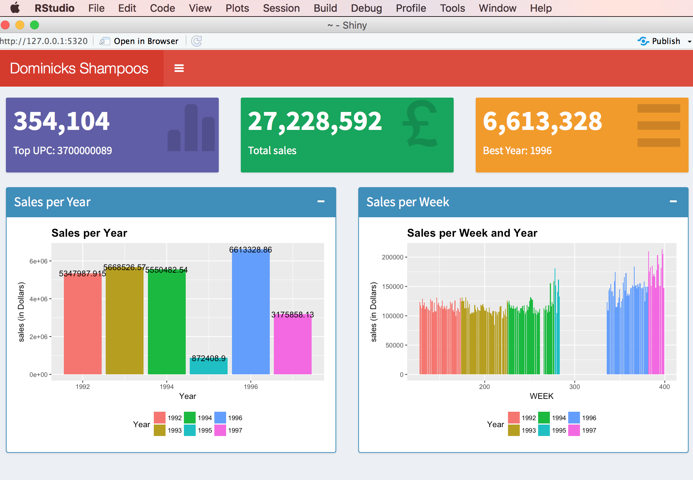

```{r setup, include=FALSE}
knitr::opts_chunk$set(echo = TRUE)
```


#Data Exploration

#Part1 : SALES

###Loading libraries and Shampoo dataset

```{r loading the data from csv,warning=FALSE,message=FALSE}
library(dplyr)
library(knitr)
library(igraph)
library(pander)
library(ggplot2)
shadata <- read.csv("~/shadata.csv")
kable(head(shadata))
#pander(head(shadata))
#length(shadata)
#nrow(shadata)
```

###Summary

```{r,warning=FALSE,message=FALSE}
total.sales <- sum(shadata$sales)
kable(paste('Total sales is $',round(total.sales)))
sales.UPC <- shadata %>% group_by(UPC) %>% summarise(value = sum(sales)) %>% filter(value==max(value))
d=as.character(sales.UPC)
names(d)=c("Best UPC","Total Sales")
kable(d)
prof.prod <- shadata %>% group_by(Year) %>% summarise(value = sum(sales)) %>% filter(value==max(value))
kable(caption="Best Year",prof.prod)

```


### We can group the data by UPC ONLY
We can then summarize the data by average sales,quantities and by total sales 

```{r,warning=FALSE,message=FALSE}
byUPC<-shadata%>%group_by(UPC)
summarize(shadata, AvgSales= mean(sales, na.rm = T),AvgQuantity= mean(quantity_sold, na.rm = T))

UPC<- summarize(byUPC, count = n(), AvgSales = mean(sales, na.rm = F),TotalSales=sum(sales, na.rm = F), AvgQuant = mean(quantity_sold,na.rm = F), TotalQuant = sum(quantity_sold,na.rm = F))
kable(head(UPC,10))
plot(UPC$TotalQuant,UPC$TotalSales,col="blue",main="Total Sales versus quantity")
plot(UPC$AvgQuant,UPC$AvgSales,col="green",main="Average Sales versus quantity")

```

### Here we can count the number of sales by UPC and per Year

```{r,warning=FALSE,message=FALSE}
SalesYear<- group_by(shadata, Year, UPC)
per_year <- summarize(SalesYear, number_sales = n(),totalSales=sum(sales))
kable(head(per_year,10))
```


###Visualization

###Sales per year

```{r,warning=FALSE,message=FALSE}
data2<- shadata %>% group_by(Year) %>% summarise(value = sum(sales))
kable(data2)
d=arrange(data2,by_group=desc(value))# By ordering
kable(d)
g=ggplot(data = data2, aes(x=Year, y=value, fill=factor(Year))) + 
  geom_bar(position = "dodge", stat = "identity") + ylab("sales (in Dollars)") + 
  xlab("Year") + theme(legend.position="bottom" ,plot.title = element_text(size=15, face="bold")) + 
  ggtitle("Sales per Year") + labs(fill = "Year")+geom_text(aes(label=value))
g
```

###Sales per Quarter

###One way to look at it 

```{r,warning=FALSE,message=FALSE}
data3<- shadata %>% group_by(Quarter,Year) %>% summarise(value = sum(sales))
kable(head(data3))# We look at the first rows of the dataset.
g=ggplot(data = data3, aes(x=Quarter, y=value, fill=factor(Year))) + 
  geom_bar(position = "dodge", stat = "identity") + ylab("Sales (in Dollars)") + 
  xlab("Quarter") + theme(legend.position="bottom" ,plot.title = element_text(size=15, face="bold")) + 
  ggtitle("Sales per Quater and Year") + labs(fill = "Year")
g
```

###Sales By WEEK

```{r,warning=FALSE,message=FALSE}
data4<- shadata %>% group_by(WEEK,Year) %>% summarise(value = sum(sales))
kable(head(data4,10))

g=ggplot(data = data4, aes(x=WEEK, y=value, fill=factor(Year))) + 
  geom_bar(position = "dodge", stat = "identity") + ylab("Sales (in Dollars)") + 
  xlab("WEEK") + theme(legend.position="bottom" ,plot.title = element_text(size=15, face="bold")) + 
  ggtitle("Sales per Week and Year") + labs(fill = "Year")
g
```


###Saving datasets into  csv files which can be used in Gephi

```{r,warning=FALSE,message=FALSE}
#write.csv(data4, file = "Weekly.csv")
#write.csv(UPC, file = "UPC.csv") 
```

#Network Science with igraph

We can transform some of the newly created datasets into network entities for further insights
For example the total weekly sales dataset name data4 can be converted 

```{r,warning=FALSE,message=FALSE}
net=graph_from_data_frame(data4,directed=FALSE)
kable(paste("Mean Distance is :",round(mean_distance(net, directed=F),3)))
kable(paste("The graph density is:",round(graph.density(net,loop=FALSE),6)))
kable(paste("the shortest path is: ",max(shortest.paths(net,mode="all"))))
#
kable(paste("The maximum Eccentricity",max(eccentricity(net,mode="all"))))
deg <- degree(net, mode="all")
kable(paste("The diameter of this network is",diameter(net)))
kable(paste("The maximum degree is:",max(deg)))
kable(paste("The minimum degree is:",min(deg)))
kable(paste("The Average degree is:",round(mean(deg),4)))
Degree_Correlation=assortativity_degree(net,directed = F)
kable(paste("The degree correlation is:",round(Degree_Correlation,4)))# Degree correlation
plot.igraph(net,vertex.label=NA)
##Let's reduce the size of the node to have a better look 
plot.igraph(net,vertex.size=5,vertex.label=NA,edge.color="blue")
```


###Using Shiny apps
Below is an app file 

```{r,warning=FALSE,message=FALSE}
# app.R
# load the required packages
library(shiny)
require(shinydashboard)
library(ggplot2)
library(dplyr)
shadata <- read.csv("~/shadata.csv")
data2<- shadata %>% group_by(Year) %>% summarise(value = sum(sales))
data4<- shadata %>% group_by(WEEK,Year) %>% summarise(value = sum(sales))
header <- dashboardHeader(title = "Dominicks Shampoos data")  
sidebar <- dashboardSidebar(
  sidebarMenu(
    menuItem("Dashboard", tabName = "dashboard", icon = icon("dashboard"))
    
  )
)


frow1 <- fluidRow(
  valueBoxOutput("value1")
  ,valueBoxOutput("value2")
  ,valueBoxOutput("value3")
)

frow2 <- fluidRow(
  
  box(
    title = "Sales per Year"
    ,status = "primary"
    ,solidHeader = TRUE 
    ,collapsible = TRUE 
    ,plotOutput("salesbyYear", height = "300px")
  )
  
  ,box(
    title = "Sales per Week"
    ,status = "primary"
    ,solidHeader = TRUE 
    ,collapsible = TRUE 
    ,plotOutput("salesbyWeek", height = "300px")
  ) 
  
)
body <- dashboardBody(frow1, frow2)
ui <- dashboardPage(title = 'Dominicks Shampoos category', header, sidebar, body, skin='red')

server <- function(input, output) { 
  total.sales <- sum(shadata$sales)
  sales.UPC <- shadata %>% group_by(UPC) %>% summarise(value = sum(sales)) %>% filter(value==max(value))
  prof.prod <- shadata %>% group_by(Year) %>% summarise(value = sum(sales)) %>% filter(value==max(value))
  output$value1 <- renderValueBox({
    valueBox(
      formatC(sales.UPC$value, format="d", big.mark=',')
      ,paste('Top UPC:',sales.UPC$UPC)
      ,icon = icon("stats",lib='glyphicon')
      ,color = "purple")  
  })
  output$value2 <- renderValueBox({ 
    valueBox(
      formatC(total.sales, format="d", big.mark=',')
      ,'Total sales'
      ,icon = icon("gbp",lib='glyphicon')
      ,color = "green")  
  })
  output$value3 <- renderValueBox({
    valueBox(
      formatC(prof.prod$value, format="d", big.mark=',')
      ,paste('Best Year:',prof.prod$Year)
      ,icon = icon("menu-hamburger",lib='glyphicon')
      ,color = "yellow")   
  })
  output$salesbyYear<- renderPlot({
    
    ggplot(data = data2, aes(x=Year, y=value, fill=factor(Year))) + 
      geom_bar(position = "dodge", stat = "identity") + ylab("sales (in Dollars)") + 
      xlab("Year") + theme(legend.position="bottom" ,plot.title = element_text(size=15, face="bold")) + 
      ggtitle("Sales per Year") + labs(fill = "Year")+geom_text(aes(label=value))
   
  
  })
  output$salesbyWeek <- renderPlot({
    ggplot(data = data4, aes(x=WEEK, y=value, fill=factor(Year))) + 
      geom_bar(position = "dodge", stat = "identity") + ylab("sales (in Dollars)") + 
      xlab("WEEK") + theme(legend.position="bottom" ,plot.title = element_text(size=15, face="bold")) + 
      ggtitle("Sales per Week and Year") + labs(fill = "Year")
  })
}

shinyApp(ui, server)
```





